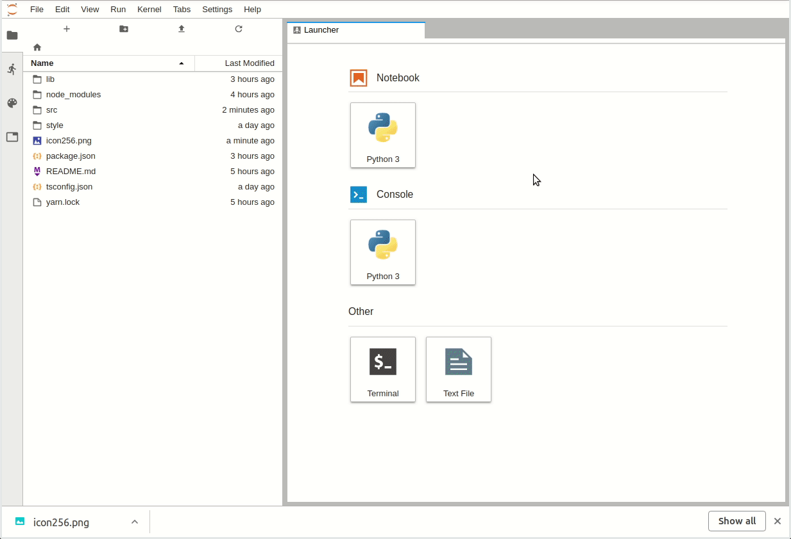

# jupyterlab-attachments

A JupyterLab extension to add support for attachments in the JupyterLab editor.


## Prerequisites

* JupyterLab

## Installation

```bash
jupyter labextension install @agoose77/jupyterlab-attachments
```

## Development

For a development install (requires npm version 4 or later), do the following in the repository directory:

```bash
npm install
npm run build
jupyter labextension link .
```

To rebuild the package and the JupyterLab app:

```bash
npm run build
jupyter lab build
```

## Usage


